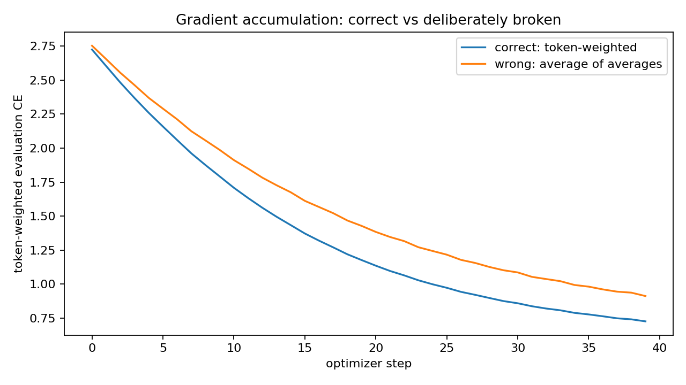
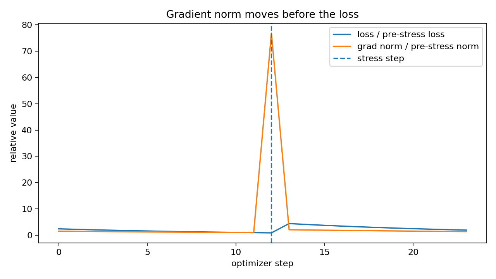

# Session 10 — The Training Loop

This repository contains a small causal language model and a real, instrumented training loop for the Session 10 assignment.

**Notebook:** `session10_training_loop.ipynb`

The notebook is deterministic (`seed=42`), has dropout disabled for the gradient audit, runs top-to-bottom, saves the two required diagnostic plots, and writes `session10_results.json`.

> The numbers below are from the validated reference run included with this submission. The reference environment was **cpu / x86_64**. The notebook detects CUDA automatically; if rerun on a Colab T4 it will recompute throughput/MFU using the T4 FP32 peak denominator.

## 1. Every tensor shape in the step

Configuration: `V=16`, `D=32`, total model parameters `N=11,680`.

| Tensor | Shape | Meaning |
|---|---:|---|
| `tokens` | `(3, 8)` | `[B,T]`: 3 sequences, padded to 8 input positions |
| `targets` | `(3, 8)` | `[B,T]`: next-token labels; padded labels are ignored |
| `embedded` | `(3, 8, 32)` | `[B,T,D]`: one 32-d representation per input position |
| `padding_mask` | `(3, 8)` | `[B,T]`: marks padded inputs |
| `causal_mask` | `(8, 8)` | `[T,T]`: blocks attention to future positions |
| `hidden` | `(3, 8, 32)` | `[B,T,D]`: contextual hidden states |
| `logits` | `(3, 8, 16)` | `[B,T,V]`: vocabulary scores |
| `valid` | `(3, 8)` | `[B,T]`: target positions contributing to CE |
| `flat_logits` | `(18, 16)` | `[N_valid,V]`: CE rows |
| `flat_targets` | `(18,)` | `[N_valid]`: correct token for each CE row |
| `loss` | `()` | scalar mean cross-entropy |

## 2. One gradient verified by hand

I checked `output_head.weight[3,20]` with a central finite difference:

```text
dL/dw ≈ [L(w+eps) - L(w-eps)] / (2*eps)
eps = 1e-05

finite difference = -0.3074262542
backward()        = -0.3074262542
absolute error    = 2.652e-11
relative error    = 8.627e-11
```

The two gradients agree far beyond several decimal places, so the autograd result and the independently measured loss slope are consistent.

## 3. Gradient accumulation broken on purpose

The correct objective is token-weighted:

```text
sum(all token losses) / total valid tokens
```

The deliberately broken version is:

```text
mean(micro-batch mean losses)
```

For the Session 10 arithmetic example:

- correct: **2.6000**
- broken: **3.0000**
- error: **15.4%**

In the real training experiment, each optimizer step uses micro-batches with **[32, 32, 8] valid tokens**. The short micro-batch therefore receives too much weight in the broken implementation.

After training:

- correct token-weighted evaluation CE: **0.727108**
- broken average-of-averages evaluation CE: **0.912962**
- gap: **0.185854**



The curves separate even though both training loops look plausible. That is the point of the exercise: a reasonable-looking loss is not proof that the accounting is correct.

## 4. Grad norm logged every step

The notebook prints the loss and global L2 gradient norm on **every diagnostic optimizer step**.

A controlled stress batch appears at step **12**. Its residual/loss is held at an ordinary scale, but its feature leverage is much larger:

- step 12: loss **0.375412**, grad norm **98.033447**
- step 13: loss **1.816994**, grad norm **2.695918**

So the gradient norm moves first; the damage becomes visible in the loss on the following step.

The main language-model loop clips gradients. This one-weight probe intentionally leaves clipping off only so the next-step loss consequence remains visible; it is a diagnostic exception, not the production recommendation.



## 5. MFU

Using the Session 10 approximation:

```text
training FLOPs/token ≈ 6N
MFU = (6 * N * tokens_per_second) / peak_FLOPs_per_second
```

Measured reference run:

- parameters `N`: **11,680**
- throughput: **16,971.8 tokens/s**
- achieved `6N` compute: **1.189 GFLOP/s**
- peak denominator: **8,100.000 GFLOP/s**
- denominator source: **approx published FP32 peak for T4**
- **MFU: 0.015%**
- **distance to 40%: 39.985 percentage points**

This is intentionally reported without trying to make the number look good. The loop is far from 40% because:

1. the model is tiny, so its matrix multiplies are too small to saturate the machine;
2. eager Python/dispatcher overhead is large relative to useful work;
3. there are no fused optimizer, attention, or MLP kernels;
4. padding and attention work are only approximately represented by the `6N` estimate;
5. this notebook is optimized for observability and correctness, not throughput.

On a final Colab GPU run, the MFU cell should be rerun and these numbers replaced by that executed notebook's values.

## 6. `0.1` in fp32, bf16, and fp8 E4M3

`0.1` has a repeating binary expansion:

```text
0.1 = 0.0001100110011001100...₂
    = 1.100110011001100...₂ × 2^-4
```

| Format | Sign | Exponent | Fraction | Full bits | Stored value |
|---|---|---|---|---|---:|
| fp32 | `0` | `01111011` | `10011001100110011001101` | `00111101110011001100110011001101` | `0.10000000149011612` |
| bf16 | `0` | `01111011` | `1001101` | `0011110111001101` | `0.10009765625` |
| fp8 E4M3 | `0` | `0011` | `101` | `00011101` | `0.1015625` |

Hex forms:

- fp32: `0x3DCCCCCD`
- bf16: `0x3DCD`
- fp8 E4M3: `0x1D`

### Which precision would I train in?

**bf16** is my default choice on hardware that supports it.

It keeps fp32's 8 exponent bits, preserving the range needed for very small gradients, while halving storage/bandwidth versus fp32. E4M3 fp8 is a serious production option, but with only 3 fraction bits it requires more careful scaling and selective higher precision. I would use fp32 for audits/reference calculations, bf16 for the default training path, and move to fp8 only after validating the recipe on the actual architecture/hardware.

## Repository contents

```text
README.md
session10_training_loop.ipynb
session10_results.json
accumulation_curves.png
grad_norm_before_loss.png
```
