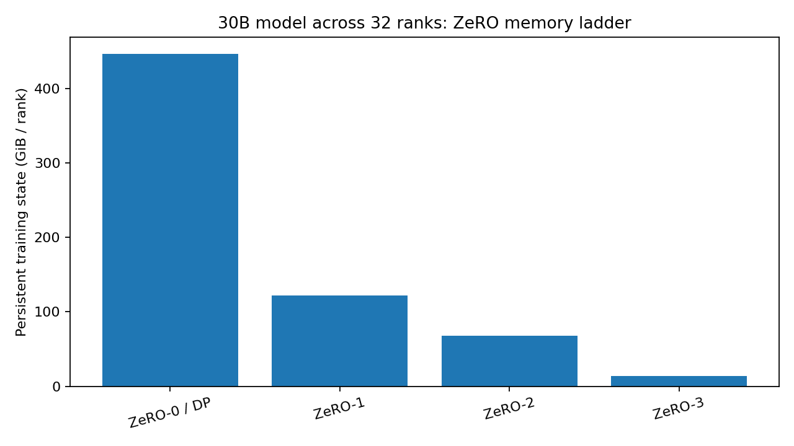
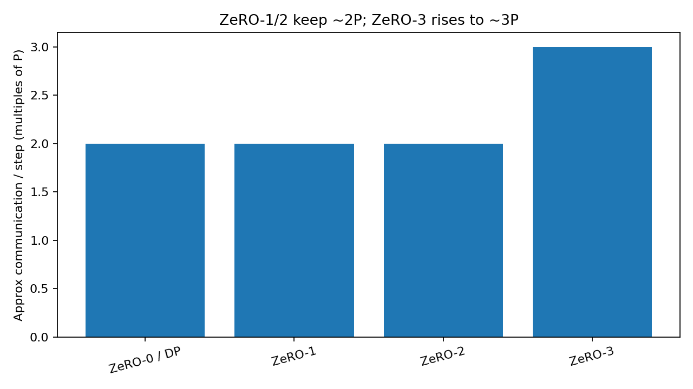
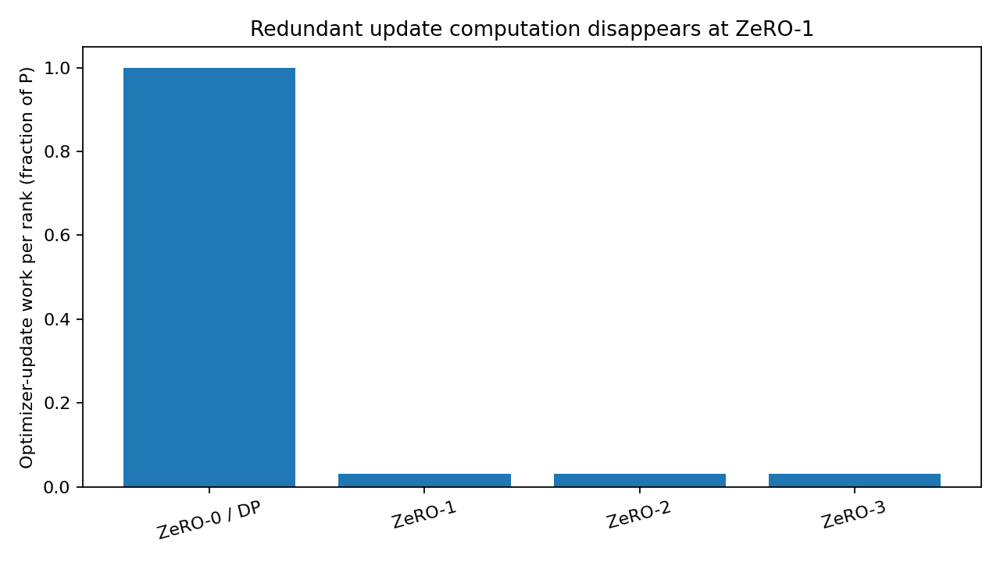

# Session 12 — 32 Virtual GPUs: ZeRO-0, ZeRO-1, ZeRO-2, ZeRO-3

## Files

- `session12_virtual_zero_32gpu-colab.ipynb` — Google Colab run notebook
- `session12_results.json` — machine-readable output from the last run on colab

## What I built

On Google Colab the notebook automatically uses a T4 when a GPU runtime is selected; otherwise it falls back to CPU.

This is a **simulation of distributed ownership and collectives**.

Each of the 32 virtual ranks gets a different local mini-batch. A real PyTorch MLP runs forward and backward for every rank, producing 32 local gradients. I then average those gradients and simulate how the same global update is stored and executed under:

1. **ZeRO-0 / data parallel** — parameters, gradients and optimizer state replicated;
2. **ZeRO-1** — optimizer state sharded;
3. **ZeRO-2** — optimizer state and gradients sharded;
4. **ZeRO-3** — optimizer state, gradients and parameters sharded.

The most important correctness test in the notebook is that **all four strategies produce exactly the same updated parameter vector** when they start from the same parameters and use the same global gradient.

Reference run maximum parameter difference:

```text
ZeRO-0 vs ZeRO-1 = 0.0
ZeRO-0 vs ZeRO-2 = 0.0
ZeRO-0 vs ZeRO-3 = 0.0
```

The post-update model loss is also identical in all four cases: **2.130857944**.

---

# Understanding

## 1. Why plain data parallelism does not solve the memory problem

With data parallelism, every GPU holds its own complete copy of the model and training state.

For the mixed-precision Adam accounting used in Session 12, every parameter costs:


| State                    | Bytes / parameter |
| ------------------------ | ----------------- |
| 16-bit working parameter | 2                 |
| 16-bit gradient          | 2                 |
| fp32 master parameter    | 4                 |
| Adam first moment        | 4                 |
| Adam second moment       | 4                 |
| **Total**                | **16**            |


Adding more data-parallel GPUs gives more compute throughput, but it does **not** reduce these 16 bytes per parameter on any individual GPU. All copies are redundant. They only increase parallel processing of training data by replicating the model over N (say 8) GPUs, giving the ability to train on Nx (8x) samples at the same time vs a single model copy on a single GPU.

**Ordinary data parallelism stores the same information many times.**

## 2. What ZeRO-1 changes

ZeRO-1 partitions the optimizer state.

Optimizer state stores first and second moment per weight, and the FP32 master copy of all weights. In ZeRO-1, these three values per weight, for 1/Nth of the weights, are stored per GPU.

The working weights and gradients are still fully replicated, so every rank still needs:

```text
2 bytes weights + 2 bytes gradients = 4 bytes / parameter
```

The 12 bytes of fp32 master weights + Adam moments are split across 32 ranks:

```text
ZeRO-1 bytes / param / rank
= 4 + 12/32
= 4.375 bytes
```

That cuts the 30B-model training state from roughly **447.0 GiB/rank** to **122.2 GiB/rank** at 32 ranks.

The other thing I learned from the simulation is that optimizer computation stops being redundant. In data parallelism, all 32 ranks apply the same optimizer update to all `P` parameters. In ZeRO-1, each rank only updates its owned `P/32` shard.

For my demo model:

- ZeRO-0 update work/rank: **6,792 parameters**
- ZeRO-1 update work/rank: **213 parameters**

The cluster goes from doing 32 copies of the same optimizer work to one unique update split across 32 owners.

## 3. What ZeRO-2 changes

ZeRO-2 also shards the gradients.

On top of the three values per weight being split across GPUs in ZeRO-1, ZeRO-2 also splits the gradients per weight across the GPUs. Hence, now 4 values per weight are being split across the GPUs - the gradients, fp32 master weights, and Adam first and second moments are sharded.

Weights are still replicated because every rank needs the full model for forward/backward, but once gradients are combined, each rank only keeps the gradient slice for the parameters it owns.

At 32 ranks:

```text
ZeRO-2 bytes / param / rank
= 2 bytes replicated working weights
  + (2 bytes gradient + 12 bytes optimizer state)/32
= 2.4375 bytes
```

For a 30B model that is about **68.1 GiB/rank** before activations and temporary buffers.

This is why the Session 12 example says ZeRO-2 begins to fit an ~80 GB-class GPU at 32 GPUs while ZeRO-1 still does not.

## 4. What ZeRO-3 changes

ZeRO-3 also shards the parameters themselves.

ZeRO-3 extends ZeRO-2 by partitioning the model weights themselves across the GPUs. For N GPUs, each GPU permanently stores only 1/N of all the 5 components: 1/N of the model weights, 1/N of the gradients, and 1/N of the optimizer state. This means that all major training-state components are now sharded.

Now there is no permanent full-model copy on each rank:

```text
ZeRO-3 bytes / param / rank
= 16/32
= 0.5 bytes
```

For the 30B reference model:

```text
~14.0 GiB persistent training state / rank
```

But this does **not** mean a rank can execute a layer using only one thirty-second of its weights. Before a layer runs, the required parameter shards have to be **all-gathered** so the layer can be reconstructed. After it is used, the non-owned full materialization can be released.

This is the main tradeoff I see in ZeRO-3:

> **Lowest persistent memory, but more communication and more transient materialization. This adds P to the communication side, bringing it up to 3P.**


## 5. Memory comparison at 32 ranks


| Strategy    | Bytes/param/rank | 30B model GiB/rank | Relative to DP |
| ----------- | ---------------- | ------------------ | -------------- |
| ZeRO-0 / DP | 16.0000          | 447.0              | 1.00x          |
| ZeRO-1      | 4.3750           | 122.2              | 0.273x         |
| ZeRO-2      | 2.4375           | 68.1               | 0.152x         |
| ZeRO-3      | 0.5000           | 14.0               | 0.031x         |




These values are **training-state memory**, not full peak GPU memory. Activations, temporary all-gather buffers, CUDA workspace, and other runtime memory still need room.

## 6. Communication is the price of sharding

The Session 12 accounting treats ordinary data parallelism, ZeRO-1 and ZeRO-2 as roughly the same **2P communication class**.

The reason I understand it this way is that an all-reduce can be viewed as:

```text
reduce-scatter + all-gather
```

ZeRO-1 and ZeRO-2 keep useful ownership of the intermediate shard rather than throwing it away.

ZeRO-3 needs additional parameter gathering during layer execution, raising the communication estimate to about **3P**.


| Strategy    | Approx communication / step |
| ----------- | --------------------------- |
| ZeRO-0 / DP | 2P                          |
| ZeRO-1      | 2P                          |
| ZeRO-2      | 2P                          |
| ZeRO-3      | 3P                          |




My interpretation is:

- ZeRO-1 gives a large memory saving with little change to the communication class;
- ZeRO-2 gives another memory saving while still staying near 2P;
- ZeRO-3 gives the strongest memory saving but pays for it with more parameter traffic across GPUs.


## 7. What happens to computation


### Forward/backward model computation

Each data-parallel rank still executes forward and backward on its own local batch.

ZeRO does not magically divide a normal layer's arithmetic by 32.

With ZeRO-3, parameters are sharded while idle, but the layer is reconstructed when it is executed. The layer math itself is still the same layer math.

### Optimizer update computation

This *does* change dramatically.


| Strategy    | Update work per rank | Cluster-wide redundant update factor |
| ----------- | -------------------- | ------------------------------------ |
| ZeRO-0 / DP | P                    | 32x                                  |
| ZeRO-1      | ~P/32                | 1x                                   |
| ZeRO-2      | ~P/32                | 1x                                   |
| ZeRO-3      | ~P/32                | 1x                                   |




This was one of the most useful outcomes of the exercise for me: the main compute saving demonstrated here is elimination of **redundant optimizer work**, not elimination of forward/backward neural-network FLOPs.

## 8. What the 32 virtual GPUs actually mean

The reference notebook run used:

```text
physical device: cpu
hardware: x86_64
virtual ranks: 32
demo parameters: 6,792
local batch/rank: 8
global batch: 256
```

On Colab T4, all tensors live on the T4 but the 32 virtual ranks execute sequentially. This is enough to demonstrate:

- local batches per rank;
- local gradients;
- global gradient averaging;
- rank ownership of shards;
- reduce-scatter/all-gather semantics;
- persistent memory accounting;
- optimizer work;
- mathematical equivalence of all strategies.

It does **not** measure:

- real NVLink or InfiniBand bandwidth;
- collective latency across 32 devices;
- multi-node contention;
- true overlap between communication and backward compute;
- actual ZeRO-3 transient peak allocation on 32 physical GPUs.


## 9. Final comparison


| Property              | ZeRO-0 / DP | ZeRO-1      | ZeRO-2      | ZeRO-3      |
| --------------------- | ----------- | ----------- | ----------- | ----------- |
| Parameters            | replicated  | replicated  | replicated  | **sharded** |
| Gradients             | replicated  | replicated  | **sharded** | **sharded** |
| Optimizer state       | replicated  | **sharded** | **sharded** | **sharded** |
| Optimizer update/rank | P           | P/32        | P/32        | P/32        |
| Approx comm           | 2P          | 2P          | 2P          | 3P          |
| 30B state/rank @ 32   | 447.0 GiB   | 122.2 GiB   | 68.1 GiB    | 14.0 GiB    |


My shortest summary is:

> **ZeRO removes redundancy one category at a time: optimizer state, then gradients, then parameters. Each step reduces persistent memory. ZeRO-1 and ZeRO-2 get most of that saving without increasing the data-parallel communication class; ZeRO-3 goes further but has to fetch sharded parameters when layers execute.**

---

